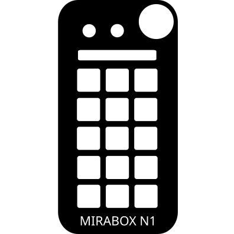

# OpenDeck Mirabox N1 Plugin

An unofficial OpenDeck plugin for the Mirabox N1.

Based on [opendeck-akp03](https://github.com/4ndv/opendeck-akp03) by Andrey Viktorov.

## OpenDeck version

Requires OpenDeck 2.5.0 or newer

## Supported devices

- Mirabox N1 (6603:1000)

The N1 has 15 LCD keys (5 rows × 3 columns, numpad-style), one knob and two extra buttons.
In OpenDeck the knob and the two buttons are exposed as the encoder row (left to right:
button A, button B, knob). The knob supports both rotation and press; the two buttons are
press-only.

## Notes on the N1

- The device boots into its built-in numpad layer. The plugin sends a mode-switch command on
  connect to put it into the "PC / stream-dock" mode where host images are displayed, and a
  periodic keep-alive so it doesn't drop off the USB bus.
- Key LCD resolution is 108×104, displayed upright (no rotation/mirroring).

## Platform support

- Linux: developed and tested here
- Mac / Windows: untested, best effort (build targets are wired up but unverified)

## Installation

1. Build the plugin (see below) or grab a release archive
2. In OpenDeck: Plugins -> Install from file
3. Linux: copy [udev rules](./40-opendeck-mirabox-n1.rules) into `/etc/udev/rules.d/` and run
   `sudo udevadm control --reload-rules`
4. Unplug and plug the device again, restart OpenDeck

## Building

### Prerequisites

- Rust 1.87+ with the `x86_64-unknown-linux-gnu` target
- For cross builds: `x86_64-pc-windows-gnu` target, mingw-w64 gcc, Docker, and [just](https://just.systems)

### Local debug build

```sh
cargo build
```

### Release package

```sh
just package
```

## Acknowledgments

Built on top of [mirajazz](https://github.com/4ndv/mirajazz) and the
[opendeck-akp03](https://github.com/4ndv/opendeck-akp03) / opendeck-akp153 plugins by Andrey
Viktorov, which are in turn based on work by contributors of the
[elgato-streamdeck](https://github.com/streamduck-org/elgato-streamdeck) crate.
